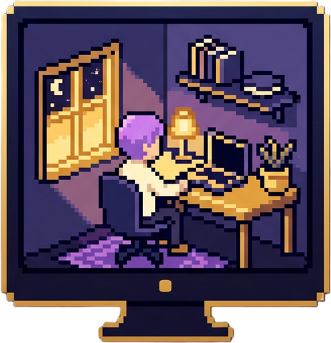
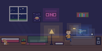
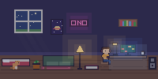
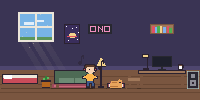
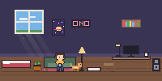
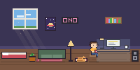
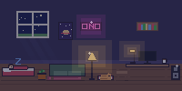

# Desktop World

**A tiny pixel world that lives on your desktop.**

---

A pixel character moves into a little room above your taskbar. It codes when you code, games when you game, and dances when your music plays. Every minute you spend on your PC earns XP and coins for the room.

No account needed. Your activity stays on your PC.

## Screenshots

<table>
<tr>
<td> Coding</td>
<td> Gaming</td>
<td> Music</td>
</tr>
<tr>
<td> Chatting</td>
<td> Studying</td>
<td> Away</td>
</tr>
</table>

## What is it?

Part companion, part game, part mirror of your day. Desktop World is a free app for Windows. It adds a small window above your taskbar with a pixel room and a character who lives in it. You keep working, gaming or listening to music like always — Desktop World sees what kind of thing you're doing and your character does it too. Nothing to set up, nothing to click.

- **A little companion** — someone small keeps you company while you work, play or wind down, with moods, habits and a pet if you adopt one.
- **A cosy collecting game** — time on your PC earns XP and coins. Unlock furniture, outfits and new rooms, finish daily quests and collect achievements.
- **A mirror of your day** — see how your hours split between work, play and everything else, and how this week compares with the last.
- **Stays out of the way** — steps aside when a game or video goes fullscreen, and only draws when something changes.
- **Honest by design** — reads only the name of the program in front, never window titles, keystrokes or screenshots. Crash reports and anonymous usage numbers are off until you say yes.

## Download

Grab the latest installer from the [**Releases**](https://github.com/turki1152/desktop-world-releases/releases/latest) page. Windows 10 & 11, free.

## Links

- Website: [desktop-world.online](https://desktop-world.online)
- Privacy policy: [desktop-world.online/privacy](https://desktop-world.online/privacy)

---

This repository hosts official downloads and media for Desktop World only. It is closed-source — the app's source code is not published here.
